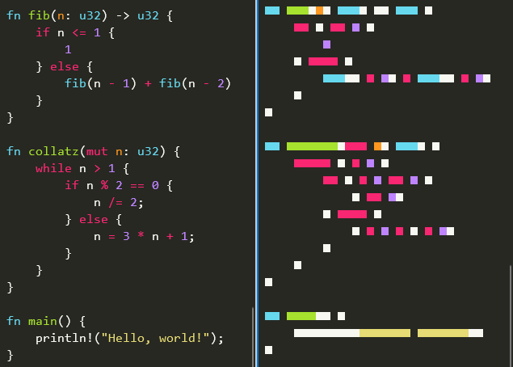

# megamap

[](https://github.com/mosmeh/megamap/actions)

`megamap` displays source code minimaps in terminal.



`megamap` is currently just for a fun purpose since `megamap`'s output takes up exactly the same space as the code does.

Let me know if you found use cases where `megamap` is actually useful.

## Installation

Clone this repository and run:

```sh
cargo install --path .
```

## Usage

Display one or multiple files:

```sh
megamap foo.rs

megamap src/*.rs
```

Read from standard input:

```sh
# detect a language from shebangs or mode lines
curl -s https://sh.rustup.rs | megamap

# specify the language explicitly
cat foo.rs | megamap -l rust
```

## Colors

It supports terminals with and without 24-bit true colors.

Make sure the variable `$COLORTERM` is set to `truecolor` or `24bit` to enable true colors.

Refer to [this gist](https://gist.github.com/XVilka/8346728) to see which terminals support true colors.

## Command-line options

```
USAGE:
    megamap [OPTIONS] [file]...

FLAGS:
    -h, --help       Prints help information
    -V, --version    Prints version information

OPTIONS:
    -l, --language <language>    Explicitly set the language for syntax highlighting
    -c, --columns <columns>      Maximum number of columns
    -t, --tabs <tabs>            Tab width

ARGS:
    <file>...    File(s) to highlight
```
